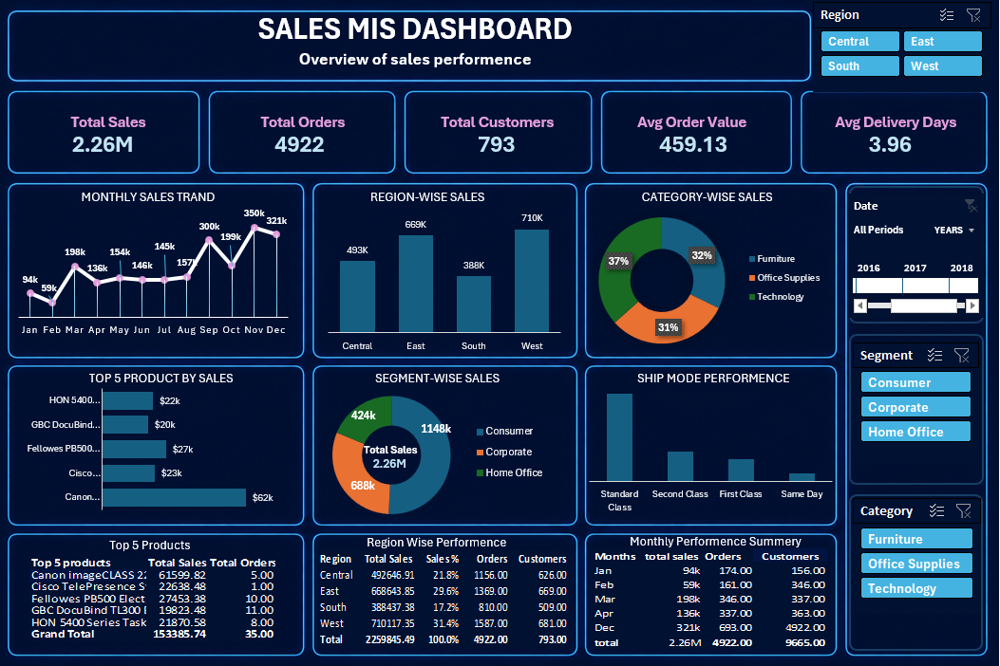

# Sales MIS Dashboard

## Project Overview

This project focuses on analyzing sales performance, customer contribution, product trends, regional sales, and shipping efficiency using an interactive Sales MIS Dashboard developed in Microsoft Excel.

The dashboard helps management monitor business performance through KPIs, Pivot Tables, Pivot Charts, slicers, and interactive visualizations.

---

# Objective

The objective of this project is to develop an interactive Sales MIS Dashboard that provides insights into:

- Sales performance
- Customer contribution
- Product performance
- Regional sales analysis
- Shipping efficiency
- Business trends

The dashboard enables management to make data-driven decisions effectively.

---

# Tools & Technologies Used

- Microsoft Excel
- Power Query
- Power Pivot
- Pivot Tables
- Pivot Charts
- DAX
- Data Cleaning
- Data Visualization

---

# Data Cleaning & Transformation

The following data cleaning steps were performed:

- Checked data types
- Removed duplicate records
- Handled null values
- Checked missing values
- Corrected inconsistent data
- Removed unnecessary columns
- Created calculated columns
- Created Calendar Table
- Created Delivery Days column

---

# Calculated Columns Created

### Delivery Days
Calculated shipping duration using:

```excel
Ship Date - Order Date
```

### Month
Extracted month from Order Date.

### Year
Extracted year from Order Date.

### Short Product Name
Created shortened product names for better dashboard visualization.

---

# KPIs Tracked

The dashboard tracks the following KPIs:

- Total Sales
- Total Orders
- Total Customers
- Average Order Value
- Average Delivery Days

---

# Dashboard Features

The dashboard includes:

- Monthly Sales Trend Analysis
- Region-wise Sales Analysis
- Category-wise Sales Analysis
- Segment-wise Sales Analysis
- Top 5 Products by Sales
- Ship Mode Performance Analysis
- Interactive Slicers and Filters
- KPI Summary Cards

---

# Business Questions Solved

### 1. What is the monthly sales trend?

Analyzed month-wise sales performance to identify sales growth patterns and peak-performing months.

---

### 2. Which region generated highest sales?

Compared sales across regions to identify the highest revenue-generating region.

---

### 3. Which category contributed maximum revenue?

Analyzed category-wise contribution to identify top-performing product categories.

---

### 4. Which products generated highest sales?

Identified top-selling products based on revenue contribution.

---

### 5. Which customer segment contributed highest sales?

Compared customer segments to understand customer contribution patterns.

---

### 6. Which ship mode was used most frequently?

Analyzed shipping methods to identify the most frequently used ship mode.

---

# Key Business Insights

- West region generated the highest sales contribution.
- Technology category contributed maximum revenue.
- Consumer segment contributed more than 50% of total sales.
- Standard Class was the most frequently used shipping mode.
- Canon imageCLASS 2200 was the highest-selling product.
- Sales performance increased significantly during Q4.

---

## Dashboard Preview



---

# File Structure

```text
Sales-MIS-Dashboard/
│
├── Sales MIS Dashboard.xlsx
├── Sales MIS Report.pdf
├── Dashboard Screenshot.png
└── README.md
```

---

# Project Workflow

1. Requirement Understanding
2. Data Collection
3. Data Cleaning
4. Data Transformation
5. KPI Creation
6. Pivot Table Analysis
7. Dashboard Development
8. Business Insight Generation
9. Report Documentation

---

# Conclusion

The Sales MIS Dashboard provides a centralized view of sales performance, customer contribution, product trends, regional analysis, and shipping efficiency.

The project demonstrates the use of Excel, Power Query, Power Pivot, Pivot Tables, and DAX to build an interactive business reporting solution for management decision-making.

---

# Author

Sourav Jha

Excel | MIS Reporting | Data Analysis | Dashboard Development
